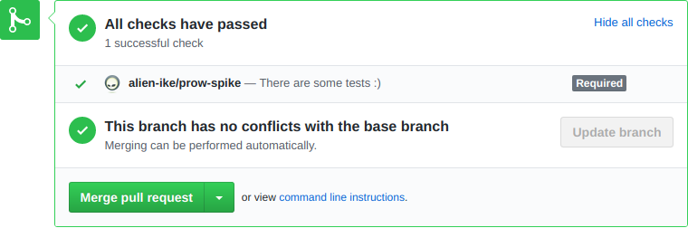
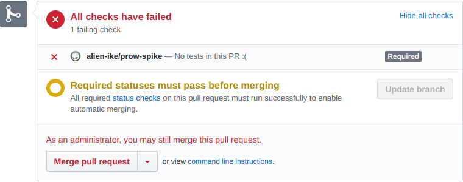

== Test Keeper plugin

This plugin can help you stick to the rule that every feature you ship comes with automated way of assuring it works - by using automated tests. 
If it won't find any tests in the Pull Request, it adds a comment with a description and marks its check as **Failure**, or as **Success** otherwise (see the screenshots below):

This check is done based on the file name patterns - for more information head over to <<testkeeper-config>> part.
  
The plugin is triggered when the Pull Request is opened/reopened or updated by new or removed commit.

If, for whatever reason, you want to bypass this check - simply comment using `const:pkg/plugin/test-keeper/plugin/event_handler.go[name="SkipComment"]` command. If you are an admin user you will see the **Success** status.
If the comment will be later removed the check is triggered again.

=== Configuration [[testkeeper-config]]

To configure Test Keeper plugin place `test-keeper.yml` file in the root of your project and use properties described below.

[source, yml, indent=0]
----
include::../pkg/plugin/test-keeper/plugin/test_fixtures/github_calls/prs/with_tests/test-keeper.yml[]
----

<1> Defines set of regular expressions which will be used to match files changeset and determine if Pull Requests comes with any changed test files.
<2> These regular expressions will be used against changeset in the Pull Requests to exclude files that don't have to be verified by any test. If only such files exists the check will be marked as "Success" as no tests are expected for such a PR.
<3> Allows you to decide if you want to combine your patterns with predefined defaults (`true` by default).
<4> Sets either relative path or absolute URL to a file that contains a message to be added to the Pull Request when no test is found (if nothing is set then a link:https://github.com/arquillian/ike-prow-plugins/tree/master/pkg/plugin/test-keeper/plugin/comment_message.go[default message] is used).

IMPORTANT: The configuration file is always loaded from the `HEAD` of the Pull Request.

==== Default exclusions

We have included few reasonable defaults for verifying if the PR comes with the tests. You can see them link:https://github.com/arquillian/ike-prow-plugins/blob/9ebe5bc5d3daf3bf50d1538fe86c9099624149b0/pkg/plugin/test-keeper/plugin/matchers.go#L53-L95[here].

NOTE: If we missed some important patterns feel free to open an link:https://github.com/arquillian/ike-prow-plugins/issues/new[issue] or better yet - a link:https://github.com/arquillian/ike-prow-plugins/pulls/new[Pull request]!
